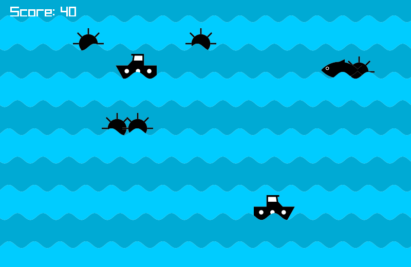

## Mirror Boats

### Description

A game where you control two mirrored boats and collect fish, avoiding mines.

Made for the raylib NEXT gamejam, but I wasn't able to submit on time.

### Features

 - Made in C++ with raylib
 - Graphics made with Inkscape
 - Sound effects made with rFXGen

### Controls

Keyboard:
 - UP: move boat up
 - DOWN: move boat down
 - SPACE: start/restart game

### Links

 - itch.io Release: [Mirror Boats](https://dcampos.itch.io/mirror-boats)

### License

This project sources are licensed under an unmodified zlib/libpng license, which is an OSI-certified, BSD-like license that allows static linking with closed source software. Check [LICENSE](LICENSE) for further details.

*Copyright (c) 2024 dcampos*
